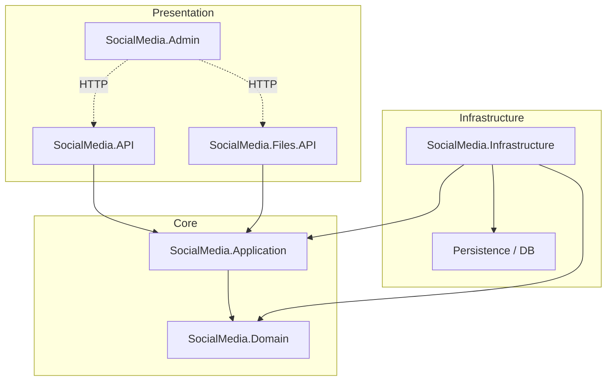

# SocialMedia

## Overview
SocialMedia is a comprehensive .NET solution built using **Clean Architecture** principles. It serves as the backend for a social media platform, managing core entities such as **Users**, **Posts**, **Comments**, **Likes**, and **Polls**.

The service is designed to be scalable, maintainable, and testable, separating core business logic from external concerns.

## Architecture
The project is organized into the following layers:



- **Domain**: Contains enterprise logic and entities. No external dependencies.
- **Application**: Contains business logic and use cases (CQRS Commands and Queries). Depends only on Domain.
- **Infrastructure**: Implements interfaces defined in Application/Domain (e.g., Repositories, External Services).
- **API**: The main REST API entry point for the application.
- **Files.API**: Microservice for file upload/download with database sharding support.
- **Admin**: React-based SPA for system administration and monitoring.

## Getting Started

### Prerequisites
- [.NET 10.0 SDK](https://dotnet.microsoft.com/download/dotnet/10.0)
- SQL Server (LocalDB or Docker container)
- [Node.js 18+](https://nodejs.org/) (for Admin Dashboard)

### Build
To build the entire solution:
```bash
dotnet build
```

### Run
To run the API project:
```bash
dotnet run --project SocialMedia.API
```
The API will be available at `https://localhost:7057` (or similar, check console output).

## Documentation
Detailed documentation is available in the `docs/` folder:

- 📘 **[Domain Documentation](docs/DOMAIN.md)**: Class diagrams and entity relationships.
- 🚀 **[API Documentation](docs/API.md)**: Endpoints, authentication, and usage flows.
- 🏗️ **[Architecture Guide](docs/ARCHITECTURE.md)**: Deep dive into CQRS, patterns, and folder structure.
- 🧪 **[Testing Guide](docs/TESTING.md)**: Integration testing patterns and best practices.
- 👨‍💼 **[Admin Dashboard](docs/ADMIN.md)**: Admin SPA setup and features.
- 📁 **[File Management API](docs/FILES_API.md)**: File service architecture and endpoints.
