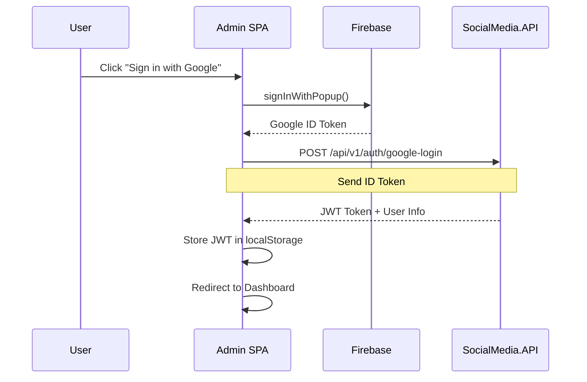

# Admin Dashboard Documentation

The **SocialMedia.Admin** project is a React-based Single Page Application (SPA) for system administration and monitoring.

## Technology Stack

- **React 18** - UI library
- **TypeScript** - Type-safe JavaScript
- **Vite** - Fast build tool and dev server
- **Redux Toolkit** - State management
- **Firebase Authentication** - Google Sign-In
- **Axios** - HTTP client for API calls

## Project Structure

```
SocialMedia.Admin/
├── src/
│   ├── components/      # Reusable UI components
│   ├── pages/          # Page components (Dashboard, Users, Posts, etc.)
│   ├── services/       # API service layer
│   │   ├── api.ts      # Axios instance and interceptors
│   │   ├── authService.ts
│   │   ├── usersService.ts
│   │   ├── postsService.ts
│   │   └── ...
│   ├── store/          # Redux store and slices
│   │   ├── authSlice.ts
│   │   ├── usersSlice.ts
│   │   ├── postsSlice.ts
│   │   └── ...
│   ├── firebaseConfig.ts
│   └── index.tsx
├── package.json
└── vite.config.ts
```

## Features

### Dashboard Statistics

The dashboard displays real-time and historical statistics:

- **Active Users**: Users active in the current period
- **Total Posts**: All posts in the system
- **Comments**: Total comments count
- **Reactions**: Total reactions with emoji breakdown
- **Historical Charts**: Weekly and monthly trends

**Route**: `/dashboard`

### User Management

Administrators can view and manage users:

- View all registered users
- Ban/unban users
- View user activity and statistics
- Search and filter users

**Route**: `/users`

### Content Management

#### Posts Management

- View all posts across all groups
- Delete inappropriate posts
- View post details and engagement metrics

**Route**: `/posts`

#### Groups Management

- Create new groups
- Edit group settings (name, description, type)
- View group members and activity

**Route**: `/groups`

#### Polls Management

- Create polls within groups
- View poll results and vote counts
- Close/activate polls

**Route**: `/polls`

### Reports & Moderation

- View user-submitted reports
- Review reported posts and comments
- Take moderation actions (dismiss, delete content, ban users)

**Route**: `/reports`

## Authentication Flow

The Admin Dashboard uses **Firebase Google Authentication**:



### Authorization

- Only users with the **Admin** role can access the dashboard
- JWT token is automatically attached to all API requests via Axios interceptors
- On 401/403 errors, user is redirected to login page

## Running Locally

### Prerequisites

- Node.js 18 or higher
- npm or yarn

### Setup

1. **Install dependencies**:
   ```bash
   cd SocialMedia.Admin
   npm install
   ```

2. **Configure Firebase**:
   
   Update `src/firebaseConfig.ts` with your Firebase project credentials:
   ```typescript
   const firebaseConfig = {
     apiKey: "YOUR_API_KEY",
     authDomain: "YOUR_AUTH_DOMAIN",
     projectId: "YOUR_PROJECT_ID",
     // ...
   };
   ```

3. **Configure API endpoints**:
   
   Update `src/services/api.ts` to point to your backend:
   ```typescript
   const API_BASE_URL = 'https://localhost:7057/api/v1';
   const FILES_API_URL = 'https://localhost:7058';
   ```

### Development

Start the development server:

```bash
npm run dev
```

The app will be available at `http://localhost:5173` (or another port if 5173 is in use).

### Building for Production

Build the optimized production bundle:

```bash
npm run build
```

The built files will be in the `dist/` folder.

Preview the production build locally:

```bash
npm run preview
```

## State Management

The application uses **Redux Toolkit** for centralized state management:

### Key Slices

- **authSlice**: User authentication state, JWT token
- **usersSlice**: Users list, selected user, loading states
- **postsSlice**: Posts list, pagination, filters
- **groupsSlice**: Groups list, selected group
- **pollsSlice**: Polls list, voting state
- **statsSlice**: Dashboard statistics data

### Example: Fetching Users

```typescript
// In a component
import { useAppDispatch, useAppSelector } from '../store/hooks';
import { fetchUsers } from '../store/usersSlice';

function UsersPage() {
  const dispatch = useAppDispatch();
  const { users, loading } = useAppSelector(state => state.users);

  useEffect(() => {
    dispatch(fetchUsers());
  }, [dispatch]);

  // Render users...
}
```

## API Integration

All API calls go through the centralized `api.ts` service:

### Interceptors

**Request Interceptor**: Automatically adds JWT token to all requests
```typescript
api.interceptors.request.use(config => {
  const token = localStorage.getItem('token');
  if (token) {
    config.headers.Authorization = `Bearer ${token}`;
  }
  return config;
});
```

**Response Interceptor**: Handles 401/403 errors by redirecting to login
```typescript
api.interceptors.response.use(
  response => response,
  error => {
    if (error.response?.status === 401 || error.response?.status === 403) {
      localStorage.removeItem('token');
      window.location.href = '/login';
    }
    return Promise.reject(error);
  }
);
```

## Common Issues

### Issue: "Access denied" after refresh

**Cause**: Race condition in `useAuth` hook calling `logout()` during initialization.

**Solution**: Ensure `authService.logout()` is only called when explicitly logging out, not during token validation.

### Issue: Stats not updating

**Cause**: Backend stats collection may not be running or data is stale.

**Solution**: Check that the stats background service is running in the API. Verify the `/api/v1/stats/history` endpoint returns data.

## Deployment

The Admin SPA can be deployed to:

- **Azure Static Web Apps**
- **Netlify**
- **Vercel**
- **AWS S3 + CloudFront**
- Any static hosting service

Make sure to configure environment variables for:
- Firebase configuration
- API base URLs
- Any other environment-specific settings
