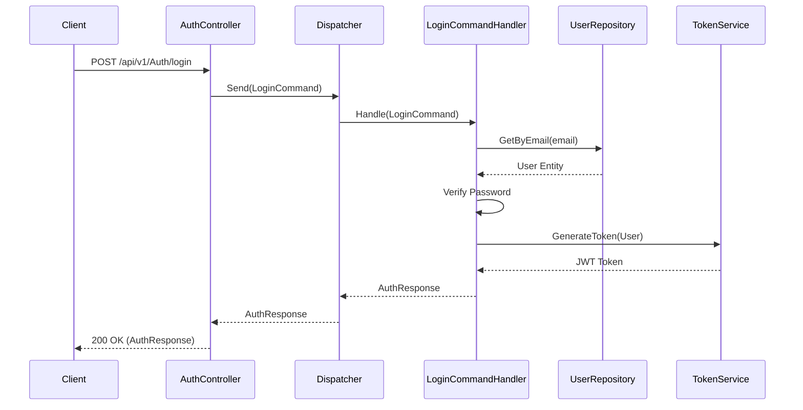
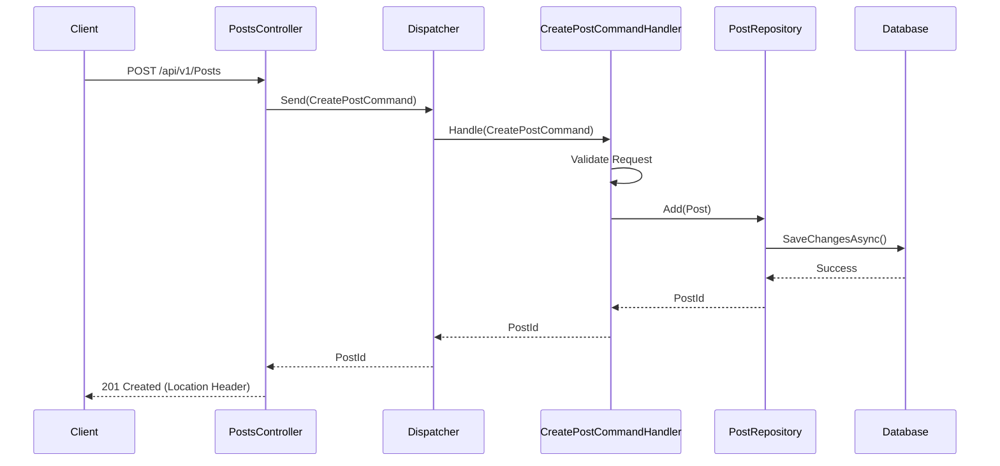

# API Documentation

The SocialMedia API is a RESTful interface built with ASP.NET Core. It uses standard HTTP methods and status codes.

## Controllers Overview

| Controller | Description | Base Path |
|------------|-------------|-----------|
| **Auth** | User registration and login. | `/api/v1/Auth` |
| **Posts** | Manage posts (create, read, report). | `/api/v1/Posts` |
| **Comments** | Manage comments on posts. | `/api/v1/Comments` |
| **Likes** | Like/unlike posts and comments. | `/api/v1/Likes` |
| **Polls** | Create and vote on polls. | `/api/v1/Polls` |
| **Users** | User profile management. | `/api/v1/Users` |
| **Groups** | Group management. | `/api/v1/Groups` |
| **Notifications** | User notifications. | `/api/v1/Notifications` |
| **Moderation** | Content moderation tools. | `/api/v1/Moderation` |
| **Reports** | Handling user reports. | `/api/v1/Reports` |

## Authentication Flow

The API uses JWT (JSON Web Tokens) for authentication.

### Login Sequence

## Content Flow

### Create Post Sequence

