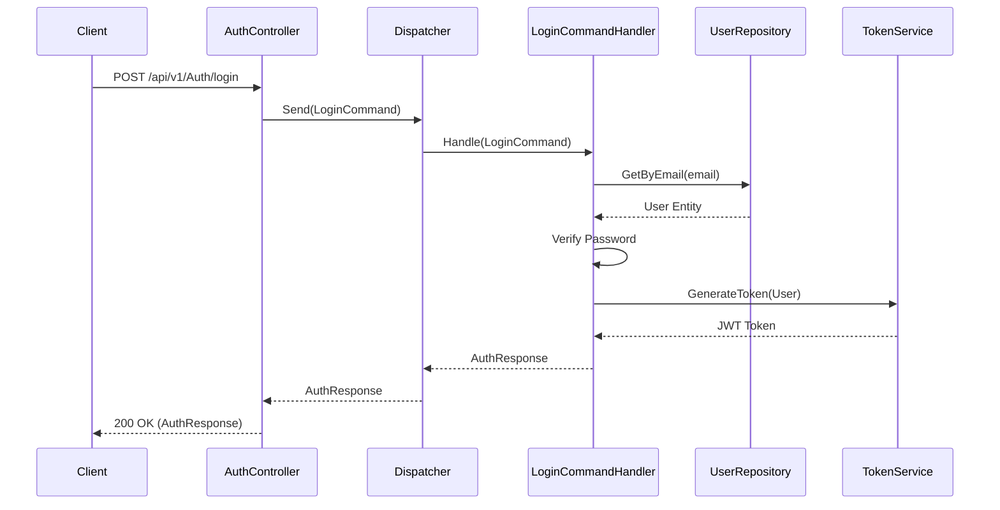
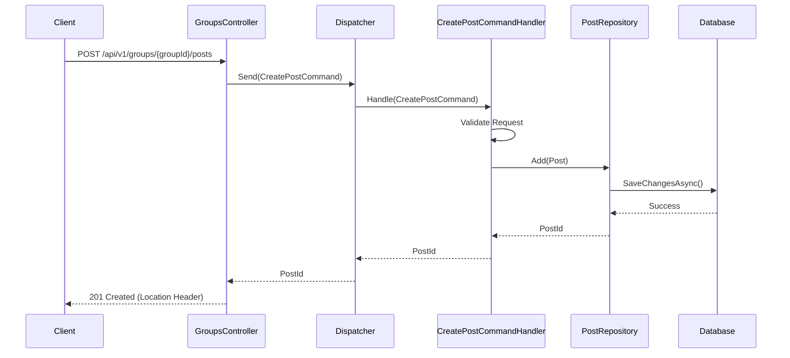
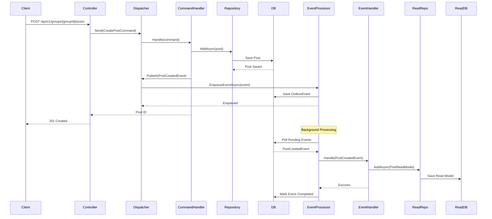
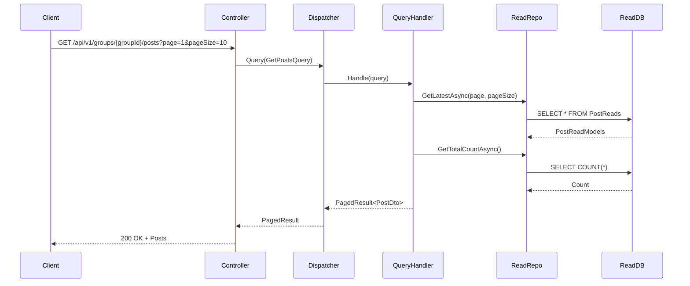
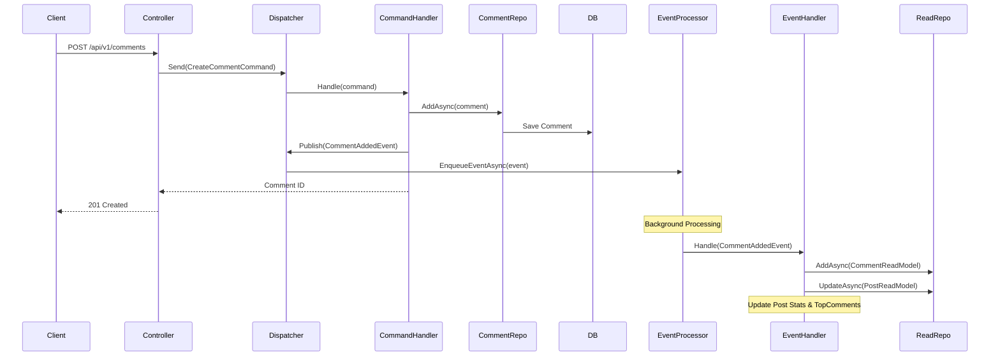
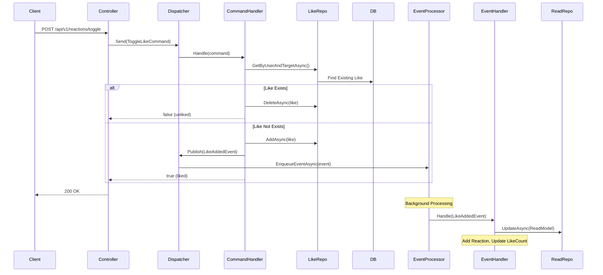
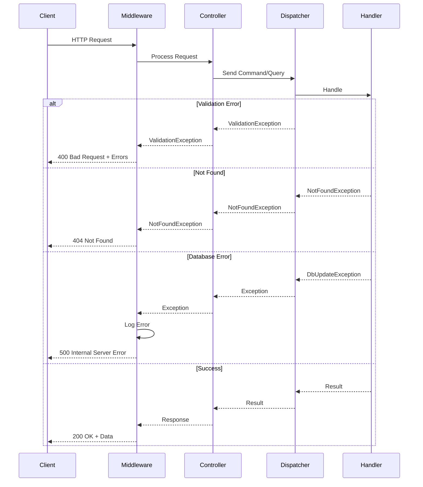
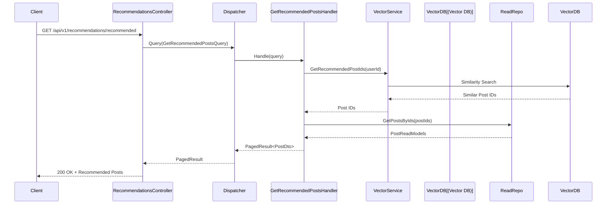
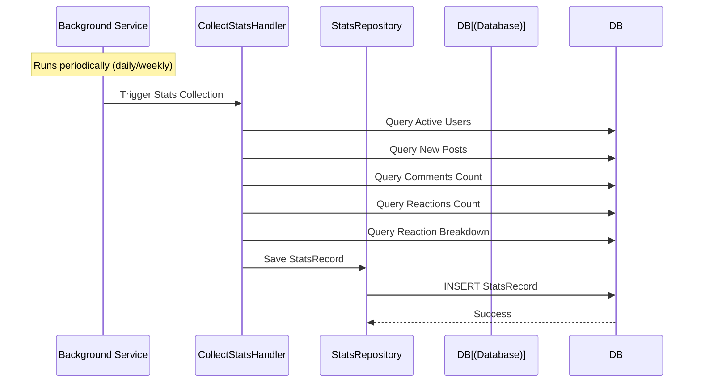

# API Documentation

The SocialMedia API is a RESTful interface built with ASP.NET Core. It uses standard HTTP methods and status codes.

## Controllers Overview

| Controller | Description | Base Path |
|------------|-------------|-----------|
| **Auth** | User registration and login. | `/api/v1/Auth` |
| **Posts** | Manage posts (read, report, delete). | `/api/v1/Posts` |
| **Comments** | Manage comments on posts. | `/api/v1/Comments` |
| **Likes** | Like/unlike posts and comments. | `/api/v1/reactions` |
| **Polls** | Create and vote on polls. | `/api/v1/Polls` |
| **Users** | User profile management. | `/api/v1/Users` |
| **Groups** | Group management and group-specific posts. | `/api/v1/Groups` |
| **Notifications** | User notifications. | `/api/v1/Notifications` |
| **Moderation** | Content moderation tools. | `/api/v1/Moderation` |
| **Reports** | Handling user reports. | `/api/v1/Reports` |
| **Defaults** | System initialization and defaults. | `/api/v1/Defaults` |
| **Stats** | Dashboard and usage statistics (history, weekly, monthly). | `/api/v1/Stats` |
| **Feedback** | User feedback submission. | `/api/v1/feedback` |
| **Recommendations** | AI-powered post recommendations based on vector similarity. | `/api/v1/recommendations` |

## Authentication Flow

The API uses JWT (JSON Web Tokens) for authentication.

### Login Sequence



## Content Flow

### Create Post Sequence

Posts are created within the context of a Group.



## Detailed Request Flows

### Create Post with Event Processing



### Get Posts Query



### Add Comment Flow



### Toggle Like Flow



### Error Handling



## Response Formats

All API responses follow a consistent structure with appropriate HTTP status codes.

## Group Access Control

The API enforces access rules based on the `GroupType`:

| Group Type | Viewing Posts/Polls | Creating Posts/Polls | Voting on Polls | Membership |
|------------|---------------|----------------|----------------|------------|
| **Everyone** | Anyone | Anyone | Anyone | Open |
| **Public** | Anyone | Members Only | Members Only | Auto-join (if enabled) |
| **Private** | Members Only | Members Only | Members Only | Invitation/Approval |

### Implementation Details

- **Viewing Posts/Polls**: Handled in `GetPostsQueryHandler` and `GetActivePollsQueryHandler` / `GetPollQueryHandler`. For **Private** groups, the `UserId` must be provided and the user must be a member.
- **Creating Posts/Polls**: Handled in `CreatePostCommandHandler` and `CreatePollCommandHandler`. For **Public** and **Private** groups, the user must be a member to create content.
- **Voting on Polls**: Handled in `VoteOnPollCommandHandler`. Users must have posting permissions in the group to vote.
- **Group Creation**: The user creating a group is automatically assigned as the `CreatorId`.

| Method | Path | Description | Access |
|--------|------|-------------|--------|
| **POST** | `/api/v1/groups/{groupId}/polls` | Create a new poll in a group. | Group Member |
| **GET** | `/api/v1/groups/{groupId}/polls` | Get active polls for a group. | Group Viewer |

## Recommendations System

The API includes an AI-powered recommendation system that suggests posts based on semantic similarity using vector embeddings.

### How It Works

1. **Embedding Generation**: Posts are converted to vector embeddings using a TinyBERT model (TensorFlow.NET)
2. **Vector Storage**: Embeddings are stored in a SQLite vector database
3. **Similarity Search**: User queries are compared against stored vectors to find semantically similar posts
4. **Personalization**: Recommendations are based on user activity and preferences

### Get Recommended Posts



**Endpoint**: `GET /api/v1/recommendations/recommended`

**Query Parameters**:
- `pageNumber` (optional, default: 1)
- `pageSize` (optional, default: 10)

**Response**: `PagedResult<PostDto>` with semantically similar posts

## Statistics & Analytics

The Stats controller provides dashboard analytics with period-based tracking.

### Available Endpoints

| Method | Path | Description |
|--------|------|-------------|
| **GET** | `/api/v1/stats/history` | Get historical stats records |
| **GET** | `/api/v1/stats/weekly` | Get weekly statistics for a specific date |
| **GET** | `/api/v1/stats/monthly` | Get monthly statistics for a specific date |

### Stats Collection Flow



### StatsRecord Structure

Each `StatsRecord` contains:
- **StatsType**: `Weekly` or `Monthly`
- **Date**: The period start date
- **TotalPosts**: Total posts in the system
- **ActiveUsers**: Users active in the period
- **NewPosts**: Posts created in the period
- **ResultingComments**: Comments on posts in the period
- **ResultingReactions**: Reactions on posts in the period
- **ReactionBreakdown**: Array of `{emoji, count}` showing reaction distribution

## Feedback System

Users can submit feedback about the application.

**Endpoint**: `POST /api/v1/feedback`

**Request Body**:
```json
{
  "content": "User feedback message"
}
```

**Response**: `200 OK` with boolean success indicator

## File Management API

The file management functionality is handled by a separate microservice (`SocialMedia.Files.API`) with database sharding support. See [Files API Documentation](FILES_API.md) for detailed information.

