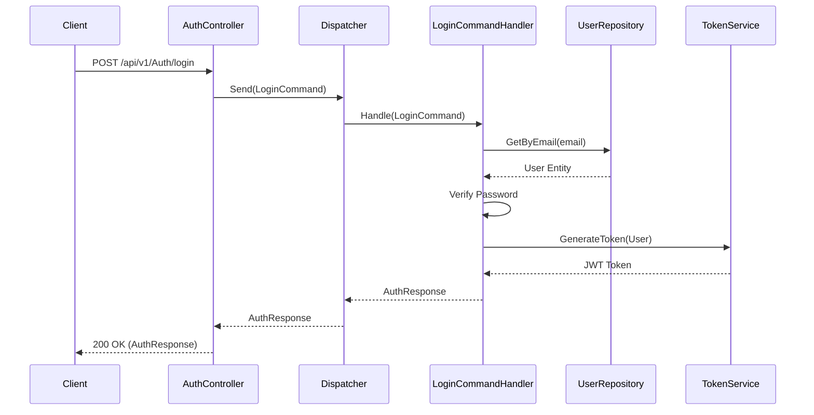
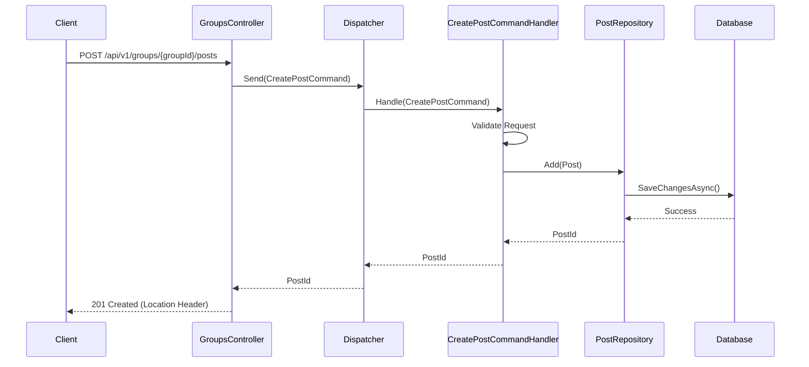
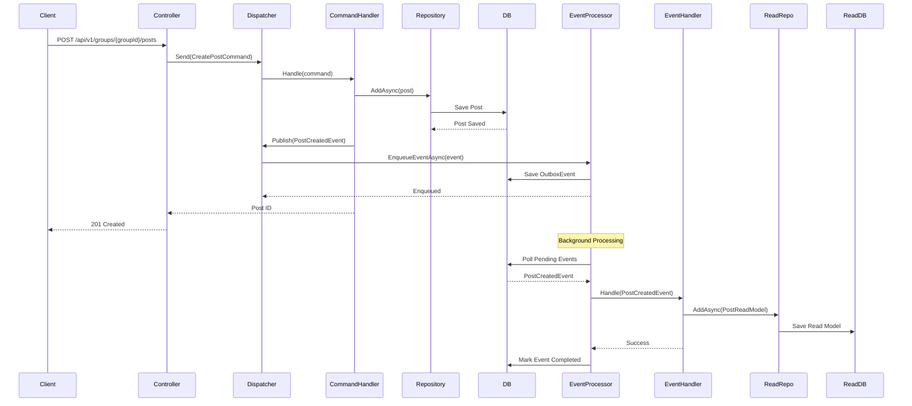
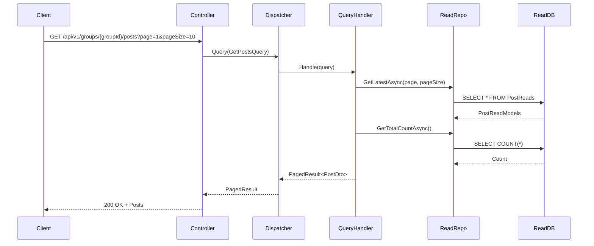
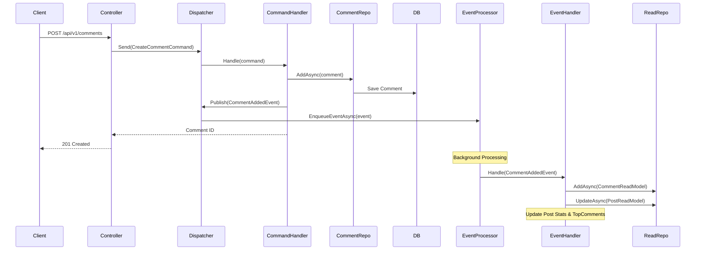
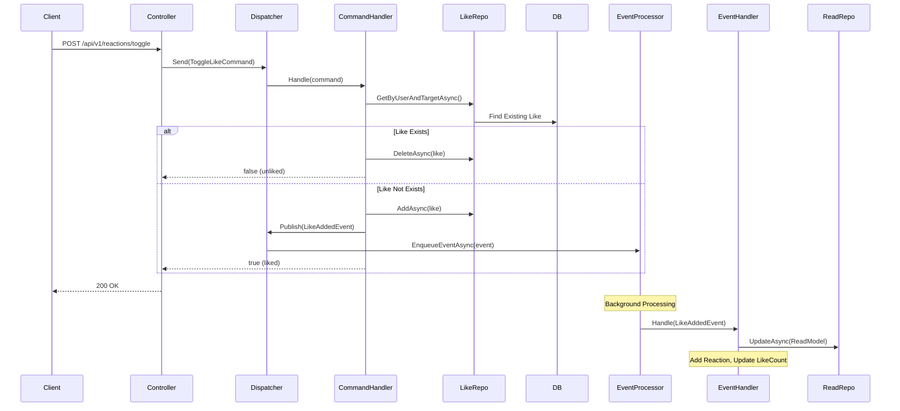
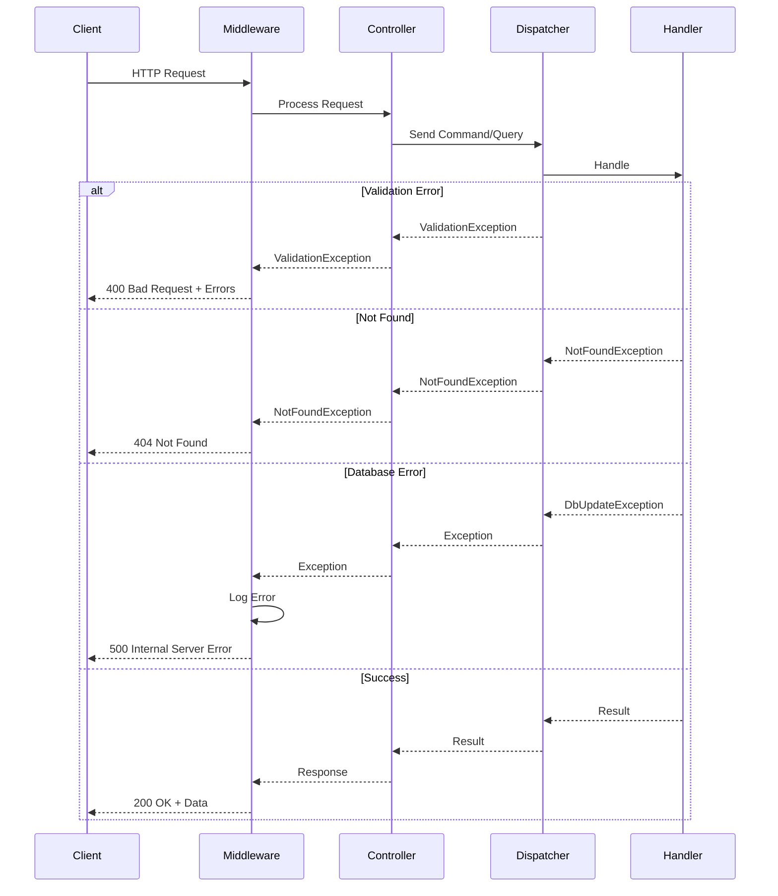

# API Documentation

The SocialMedia API is a RESTful interface built with ASP.NET Core. It uses standard HTTP methods and status codes.

## Controllers Overview

| Controller | Description | Base Path |
|------------|-------------|-----------|
| **Auth** | User registration and login. | `/api/v1/Auth` |
| **Posts** | Manage posts (read, report, delete). | `/api/v1/Posts` |
| **Comments** | Manage comments on posts. | `/api/v1/Comments` |
| **Likes** | Like/unlike posts and comments. | `/api/v1/reactions` |
| **Polls** | Create and vote on polls. | `/api/v1/Polls` |
| **Users** | User profile management. | `/api/v1/Users` |
| **Groups** | Group management and group-specific posts. | `/api/v1/Groups` |
| **Notifications** | User notifications. | `/api/v1/Notifications` |
| **Moderation** | Content moderation tools. | `/api/v1/Moderation` |
| **Reports** | Handling user reports. | `/api/v1/Reports` |
| **Defaults** | System initialization and defaults. | `/api/v1/Defaults` |
| **Stats** | Dashboard and usage statistics. | `/api/v1/Stats` |

## Authentication Flow

The API uses JWT (JSON Web Tokens) for authentication.

### Login Sequence

## Content Flow

### Create Post Sequence

Posts are created within the context of a Group.

## Detailed Request Flows

### Create Post with Event Processing

### Get Posts Query

### Add Comment Flow

### Toggle Like Flow

### Error Handling

## Response Formats

All API responses follow a consistent structure with appropriate HTTP status codes.

## Group Access Control

The API enforces access rules based on the `GroupType`:

| Group Type | Viewing Posts | Creating Posts | Membership |
|------------|---------------|----------------|------------|
| **Everyone** | Anyone | Anyone | Open |
| **Public** | Anyone | Members Only | Auto-join (if enabled) |
| **Private** | Members Only | Members Only | Invitation/Approval |

### Implementation Details

- **Viewing Posts**: Handled in `GetPostsQueryHandler`. For **Private** groups, the `UserId` must be provided in the query and the user must be a member.
- **Creating Posts**: Handled in `CreatePostCommandHandler`. For **Public** and **Private** groups, the user must be a member to create a post.
- **Group Creation**: The user creating a group is automatically assigned as the `CreatorId`.
