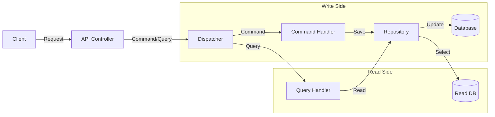
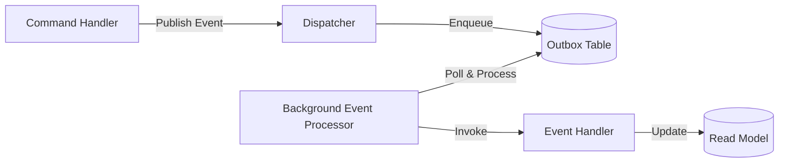
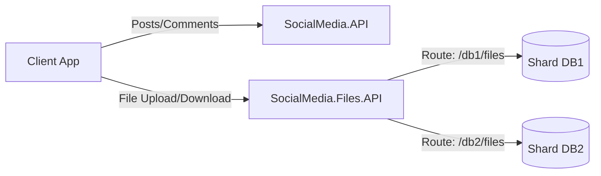
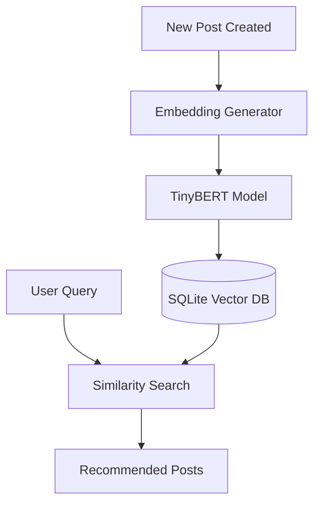

# Architecture Guide

This project follows **Clean Architecture** principles, emphasizing separation of concerns and dependency inversion.

## Project Structure

The solution is divided into multiple layers and projects:

### Core Layers

#### 1. SocialMedia.Domain
- **Role**: The core of the application. Contains enterprise logic and entities.
- **Dependencies**: None.
- **Contents**: Entities, Value Objects, Domain Events, Repository Interfaces.

#### 2. SocialMedia.Application
- **Role**: Orchestrates business logic and use cases.
- **Dependencies**: SocialMedia.Domain.
- **Contents**: 
    - **Features**: CQRS Commands and Queries (e.g., `CreatePostCommand`, `GetPostsQuery`).
    - **DTOs**: Data Transfer Objects.
    - **Interfaces**: Abstractions for infrastructure (e.g., `IEmailService`).
    - **Validators**: FluentValidation rules.

#### 3. SocialMedia.Infrastructure
- **Role**: Implements interfaces defined in Application and Domain.
- **Dependencies**: SocialMedia.Application, SocialMedia.Domain.
- **Contents**: 
    - **Persistence**: Entity Framework Core `DbContext` and Repository implementations.
    - **Services**: External service implementations (e.g., Blockchain, Vector Embeddings).

### Presentation & API Layers

#### 4. SocialMedia.API
- **Role**: The main REST API entry point for the application.
- **Dependencies**: SocialMedia.Application, SocialMedia.Infrastructure.
- **Contents**: Controllers, Middleware, Program.cs configuration.

#### 5. SocialMedia.Files.API
- **Role**: Microservice for file upload/download with database sharding support.
- **Dependencies**: Minimal - has its own DbContext for file metadata.
- **Contents**: File management controllers, sharding logic, file storage service.

#### 6. SocialMedia.Admin
- **Role**: React-based Single Page Application for system administration.
- **Technology**: React, TypeScript, Vite, Redux Toolkit, Firebase Auth.
- **Contents**: Dashboard UI, user management, content moderation interface.

## CQRS Pattern

The application uses the **Command Query Responsibility Segregation (CQRS)** pattern to separate read and write operations.

### Flow Diagram



### Data Access Strategy

- **Write Side**: Uses standard relational entities with normalized tables (`SocialMediaDbContext`).
- **Read Side**: Uses specialized Read Models (`SocialMediaReadDbContext`) optimized for querying.
    - **JSON Support**: Complex properties like `Reactions`, `TopComments`, and `Stats` are stored as JSON columns using EF Core's `ToJson()` feature. This reduces joins and improves read performance.
    - **Separation**: Read and Write concerns are physically separated at the DbContext level, allowing for potential future scaling (e.g., Read Replicas).

- **Commands**: Modify state (Create, Update, Delete). Return void or ID.
- **Queries**: Read state. Return DTOs. Never modify state.
- **Dispatcher**: Decouples Controllers from Handlers.


## Event Processing

The application uses an **Outbox Pattern** for reliable asynchronous event processing.

### Architecture



### Components

**`OutboxEvent` Entity**: Persists events with status tracking (`Pending`, `Processing`, `Completed`, `Failed`) and retry count.

**`BackgroundEventProcessor`**: 
- Serializes events to JSON using `ReferenceHandler.IgnoreCycles`
- Persists to `OutboxEvents` table
- Processes events asynchronously with retry logic (max 3 retries)

**`EventProcessorBackgroundService`**: Polls for pending events every 5 seconds and triggers processing.

**Event Handlers**: Update read models in response to domain events (`PostCreatedEvent`, `CommentAddedEvent`, `LikeAddedEvent`).

### Thread Safety

In-memory repositories use `ConcurrentDictionary<Guid, T>` for thread-safe concurrent access during background event processing.

## Microservices Architecture

The solution employs a microservices approach for specific concerns:

### File Management Microservice

**SocialMedia.Files.API** is a separate microservice responsible for file uploads and downloads:

- **Database Sharding**: Supports multiple database connections for horizontal scaling
- **Route-based Shard Selection**: Shard key can be specified in the route (`/{shardKey}/files`)
- **Deduplication**: Uses `UserFile` entity to track file ownership and prevent duplicate storage
- **Independent Deployment**: Can be scaled independently from the main API



### Benefits

- **Scalability**: File service can scale independently based on storage needs
- **Separation of Concerns**: File management logic isolated from business logic
- **Flexibility**: Easy to swap storage backends or add CDN integration

## Vector Embeddings & Recommendations

The system includes an AI-powered recommendation engine using semantic similarity:

### Architecture



### Components

**TensorFlow.NET Integration**:
- Uses TensorFlow.NET to run TinyBERT model locally
- No external API calls required
- Model downloaded and cached on first use

**Embedding Generation**:
- Posts are converted to 384-dimensional vectors
- Captures semantic meaning of post content
- Stored in SQLite database for fast retrieval

**Similarity Search**:
- Cosine similarity used to find related posts
- User activity influences recommendations
- Pagination support for large result sets

### Benefits

- **Privacy**: All processing happens locally, no data sent to external services
- **Performance**: Fast similarity search using optimized vector operations
- **Accuracy**: Semantic understanding beyond keyword matching

## Database Sharding

The Files API implements database sharding for horizontal scalability:

### Sharding Strategy

- **Shard Key**: Route-based selection (e.g., `/db1/files`, `/db2/files`)
- **Configuration**: Connection strings defined in `appsettings.json`
- **Fallback**: Defaults to `db1` if shard key not specified

### Implementation

```csharp
// DbContext configured per-request based on shard key
services.AddDbContext<FileDbContext>((sp, options) => {
    var shardKey = GetShardKeyFromRoute(); // e.g., "db1" or "db2"
    var connectionString = config.GetConnectionString(shardKey);
    options.UseSqlServer(connectionString);
});
```

### Use Cases

- **Geographic Distribution**: Different shards for different regions
- **Load Balancing**: Distribute files across multiple databases
- **Tenant Isolation**: Separate databases for different customers

## Blockchain Integration

The system includes a **Blockchain** component to ensure the integrity of the voting process.

- **`IBlockchainService`**: Interface for interacting with the blockchain.
- **Vote Recording**: Every vote is added to the blockchain when cast, creating an immutable record.
- **Verification**: The system can verify the entire chain to ensure no votes have been tampered with.

## Key Design Decisions


- **Rich Domain Model**: Entities encapsulate logic (e.g., `Post.AddComment()`).
- **Repository Pattern**: Abstracts data access logic.
- **Global Exception Handling**: Middleware catches exceptions and returns standardized error responses.
- **Validation Pipeline**: Requests are validated before reaching handlers using FluentValidation.
