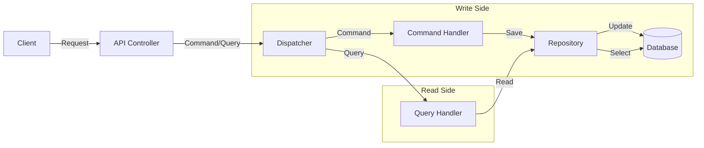

# Architecture Guide

This project follows **Clean Architecture** principles, emphasizing separation of concerns and dependency inversion.

## Project Structure

The solution is divided into four main layers:

### 1. MediaService.Domain
- **Role**: The core of the application. Contains enterprise logic and entities.
- **Dependencies**: None.
- **Contents**: Entities, Value Objects, Domain Events, Repository Interfaces.

### 2. MediaService.Application
- **Role**: Orchestrates business logic and use cases.
- **Dependencies**: MediaService.Domain.
- **Contents**: 
    - **Features**: CQRS Commands and Queries (e.g., `CreatePostCommand`, `GetPostsQuery`).
    - **DTOs**: Data Transfer Objects.
    - **Interfaces**: Abstractions for infrastructure (e.g., `IEmailService`).
    - **Validators**: FluentValidation rules.

### 3. MediaService.Infrastructure
- **Role**: Implements interfaces defined in Application and Domain.
- **Dependencies**: MediaService.Application, MediaService.Domain.
- **Contents**: 
    - **Persistence**: Entity Framework Core `DbContext` and Repository implementations.
    - **Services**: External service implementations (e.g., Blockchain, File Storage).

### 4. MediaService.API
- **Role**: The entry point for the application.
- **Dependencies**: MediaService.Application, MediaService.Infrastructure.
- **Contents**: Controllers, Middleware, Program.cs configuration.

## CQRS Pattern

The application uses the **Command Query Responsibility Segregation (CQRS)** pattern to separate read and write operations.

### Flow Diagram

- **Commands**: Modify state (Create, Update, Delete). Return void or ID.
- **Queries**: Read state. Return DTOs. Never modify state.
- **Dispatcher**: Decouples Controllers from Handlers.

## Key Design Decisions

- **Rich Domain Model**: Entities encapsulate logic (e.g., `Post.AddComment()`).
- **Repository Pattern**: Abstracts data access logic.
- **Global Exception Handling**: Middleware catches exceptions and returns standardized error responses.
- **Validation Pipeline**: Requests are validated before reaching handlers using FluentValidation.
