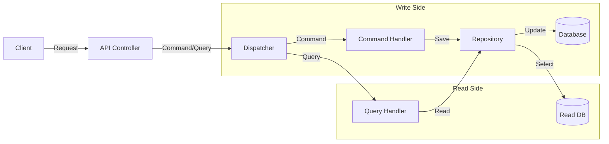
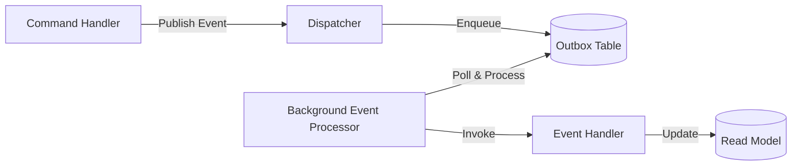

# Architecture Guide

This project follows **Clean Architecture** principles, emphasizing separation of concerns and dependency inversion.

## Project Structure

The solution is divided into four main layers:

### 1. SocialMedia.Domain
- **Role**: The core of the application. Contains enterprise logic and entities.
- **Dependencies**: None.
- **Contents**: Entities, Value Objects, Domain Events, Repository Interfaces.

### 2. SocialMedia.Application
- **Role**: Orchestrates business logic and use cases.
- **Dependencies**: SocialMedia.Domain.
- **Contents**: 
    - **Features**: CQRS Commands and Queries (e.g., `CreatePostCommand`, `GetPostsQuery`).
    - **DTOs**: Data Transfer Objects.
    - **Interfaces**: Abstractions for infrastructure (e.g., `IEmailService`).
    - **Validators**: FluentValidation rules.

### 3. SocialMedia.Infrastructure
- **Role**: Implements interfaces defined in Application and Domain.
- **Dependencies**: SocialMedia.Application, SocialMedia.Domain.
- **Contents**: 
    - **Persistence**: Entity Framework Core `DbContext` and Repository implementations.
    - **Services**: External service implementations (e.g., Blockchain, File Storage).

### 4. SocialMedia.API
- **Role**: The entry point for the application.
- **Dependencies**: SocialMedia.Application, SocialMedia.Infrastructure.
- **Contents**: Controllers, Middleware, Program.cs configuration.

## CQRS Pattern

The application uses the **Command Query Responsibility Segregation (CQRS)** pattern to separate read and write operations.

### Flow Diagram

### Data Access Strategy

- **Write Side**: Uses standard relational entities with normalized tables (`SocialMediaDbContext`).
- **Read Side**: Uses specialized Read Models (`SocialMediaReadDbContext`) optimized for querying.
    - **JSON Support**: Complex properties like `Reactions`, `TopComments`, and `Stats` are stored as JSON columns using EF Core's `ToJson()` feature. This reduces joins and improves read performance.
    - **Separation**: Read and Write concerns are physically separated at the DbContext level, allowing for potential future scaling (e.g., Read Replicas).

- **Commands**: Modify state (Create, Update, Delete). Return void or ID.
- **Queries**: Read state. Return DTOs. Never modify state.
- **Dispatcher**: Decouples Controllers from Handlers.

## Event Processing

The application uses an **Outbox Pattern** for reliable asynchronous event processing.

### Architecture

### Components

**`OutboxEvent` Entity**: Persists events with status tracking (`Pending`, `Processing`, `Completed`, `Failed`) and retry count.

**`BackgroundEventProcessor`**: 
- Serializes events to JSON using `ReferenceHandler.IgnoreCycles`
- Persists to `OutboxEvents` table
- Processes events asynchronously with retry logic (max 3 retries)

**`EventProcessorBackgroundService`**: Polls for pending events every 5 seconds and triggers processing.

**Event Handlers**: Update read models in response to domain events (`PostCreatedEvent`, `CommentAddedEvent`, `LikeAddedEvent`).

### Thread Safety

In-memory repositories use `ConcurrentDictionary<Guid, T>` for thread-safe concurrent access during background event processing.

## Blockchain Integration

The system includes a **Blockchain** component to ensure the integrity of the voting process.

- **`IBlockchainService`**: Interface for interacting with the blockchain.
- **Vote Recording**: Every vote is added to the blockchain when cast, creating an immutable record.
- **Verification**: The system can verify the entire chain to ensure no votes have been tampered with.

## Key Design Decisions

- **Rich Domain Model**: Entities encapsulate logic (e.g., `Post.AddComment()`).
- **Repository Pattern**: Abstracts data access logic.
- **Global Exception Handling**: Middleware catches exceptions and returns standardized error responses.
- **Validation Pipeline**: Requests are validated before reaching handlers using FluentValidation.
