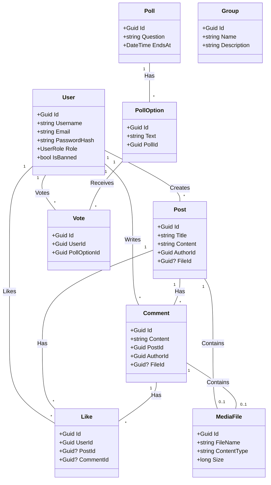

# Domain Model

The Domain layer contains the core business entities and logic. It has no dependencies on other layers.

## Class Diagram

## Entities Description

- **User**: Represents a registered user of the system.
- **Post**: A content item created by a user, which can contain text and media.
- **Comment**: A response to a post, which can also contain text and media.
- **Like**: Represents a user's positive reaction to a post or comment.
- **Poll**: A question with multiple options for users to vote on.
- **Group**: A collection of users and posts (if applicable).
- **MediaFile**: Represents an uploaded file (image, video, etc.).

## Read Models

The domain also includes specialized **Read Models** optimized for query operations. These models are denormalized and include aggregated data to improve read performance.

### PostReadModel

Optimized view of a Post with embedded statistics and related data:

- **Stats** (JSON): `LikeCount`, `CommentCount`, `TrendingScore`
- **Reactions** (JSON): Collection of user reactions with emoji support
- **TopComments** (JSON): Embedded top 30 comments with their reactions
- **Author Info**: Denormalized `AuthorName` for quick access
- **Group Info**: Optional `GroupId` and `GroupName`

### CommentReadModel

Optimized view of a Comment with embedded statistics:

- **Stats** (JSON): `LikeCount`
- **Reactions** (JSON): Collection of user reactions with emoji support
- **Author Info**: Denormalized `AuthorName` and `AuthorProfilePicUrl`

### JSON Mapping

Read Models use EF Core's `ToJson()` feature to store complex properties as JSON columns, reducing the need for joins and improving query performance. This is particularly beneficial for:

- Frequently accessed aggregated data (stats)
- Collections that are always loaded together (reactions)
- Embedded related entities (top comments)

