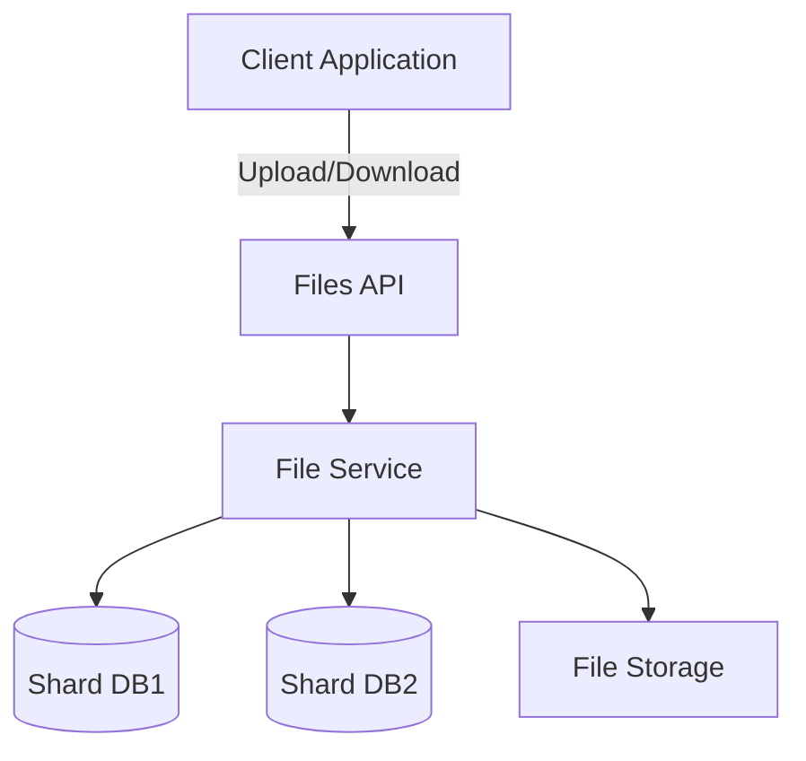
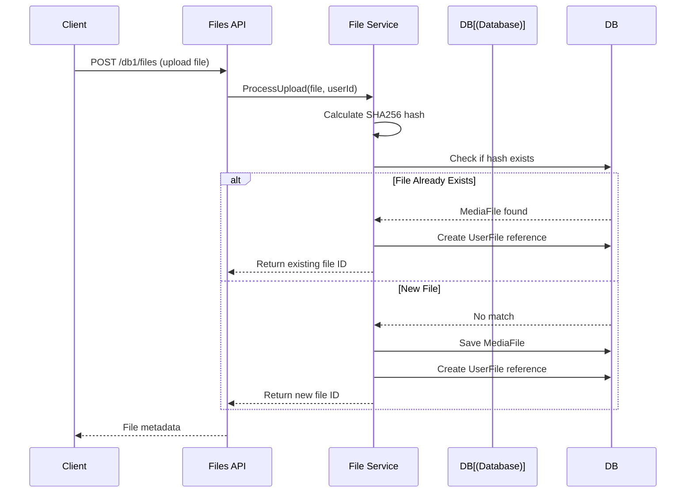

# File Management API Documentation

The **SocialMedia.Files.API** is a separate microservice responsible for file upload, download, and management with database sharding support.

## Overview

This microservice handles all file-related operations independently from the main API, allowing for:
- **Independent Scaling**: Scale file storage separately from business logic
- **Database Sharding**: Distribute files across multiple databases
- **Deduplication**: Prevent duplicate file storage using hash-based identification
- **Flexible Storage**: Easy to integrate with cloud storage (Azure Blob, AWS S3, etc.)

## Architecture



## Database Sharding

The Files API supports multiple database shards for horizontal scalability.

### Shard Selection

Shards are selected via the route path:

```
GET /{shardKey}/files/{fileId}
POST /{shardKey}/files
DELETE /{shardKey}/files/{fileId}
```

**Examples**:
- `/db1/files` - Uses database shard "db1"
- `/db2/files` - Uses database shard "db2"
- `/files` - Defaults to "db1"

### Configuration

Connection strings are defined in `appsettings.json`:

```json
{
  "ConnectionStrings": {
    "db1": "Server=localhost;Database=FilesDB1;...",
    "db2": "Server=localhost;Database=FilesDB2;..."
  }
}
```

### DbContext Configuration

The `FileDbContext` is configured per-request based on the shard key:

```csharp
services.AddDbContext<FileDbContext>((sp, options) => {
    var httpContextAccessor = sp.GetRequiredService<IHttpContextAccessor>();
    var context = httpContextAccessor.HttpContext;
    
    string shardKey = "db1"; // Default
    
    if (context?.Request.RouteValues.TryGetValue("shardKey", out var val)) {
        shardKey = val.ToString();
    }
    
    var connectionString = config.GetConnectionString(shardKey);
    options.UseSqlServer(connectionString);
});
```

## Endpoints

### Upload File

Upload a new file to the specified shard.

**Endpoint**: `POST /{shardKey}/files`

**Request**: `multipart/form-data`
- `file`: The file to upload

**Response**: `200 OK`
```json
{
  "id": "3fa85f64-5717-4562-b3fc-2c963f66afa6",
  "fileName": "image.jpg",
  "contentType": "image/jpeg",
  "size": 102400,
  "url": "/db1/files/3fa85f64-5717-4562-b3fc-2c963f66afa6"
}
```

**Example**:
```bash
curl -X POST https://localhost:7058/db1/files \
  -H "Authorization: Bearer YOUR_JWT_TOKEN" \
  -F "file=@image.jpg"
```

### Download File

Download a file by its ID from the specified shard.

**Endpoint**: `GET /{shardKey}/files/{fileId}`

**Response**: File content with appropriate `Content-Type` header

**Example**:
```bash
curl https://localhost:7058/db1/files/3fa85f64-5717-4562-b3fc-2c963f66afa6 \
  -H "Authorization: Bearer YOUR_JWT_TOKEN" \
  -o downloaded-file.jpg
```

### Delete File

Delete a file by its ID from the specified shard.

**Endpoint**: `DELETE /{shardKey}/files/{fileId}`

**Response**: `204 No Content` on success

**Example**:
```bash
curl -X DELETE https://localhost:7058/db1/files/3fa85f64-5717-4562-b3fc-2c963f66afa6 \
  -H "Authorization: Bearer YOUR_JWT_TOKEN"
```

## File Deduplication

The Files API implements deduplication using the `UserFile` entity to track file ownership.

### How It Works

1. **Hash Calculation**: When a file is uploaded, its SHA256 hash is calculated
2. **Duplicate Check**: The system checks if a file with the same hash already exists
3. **Reference Creation**: If the file exists, a new `UserFile` reference is created instead of storing the file again
4. **Storage**: Only unique files are physically stored

### Entities

#### MediaFile

Represents the physical file stored in the system:

```csharp
public class MediaFile
{
    public Guid Id { get; set; }
    public string FileName { get; set; }
    public string ContentType { get; set; }
    public long Size { get; set; }
    public string Hash { get; set; }  // SHA256 hash
    public byte[] Data { get; set; }  // File content
}
```

#### UserFile

Tracks which users have uploaded which files:

```csharp
public class UserFile
{
    public Guid Id { get; set; }
    public Guid UserId { get; set; }
    public Guid MediaFileId { get; set; }
    public DateTime UploadedAt { get; set; }
}
```

### Deduplication Flow



## Authentication

All endpoints require JWT authentication. The token must be included in the `Authorization` header:

```
Authorization: Bearer YOUR_JWT_TOKEN
```

The JWT token is validated using the same secret keys as the main API, configured in `appsettings.json`:

```json
{
  "Authentication": {
    "SecretKeys": [
      "your-secret-key-here"
    ]
  }
}
```

## Integration with Main API

The main `SocialMedia.API` references files using their IDs:

### Post with File

```json
{
  "title": "My Post",
  "content": "Check out this image!",
  "fileId": "3fa85f64-5717-4562-b3fc-2c963f66afa6"
}
```

### Comment with File

```json
{
  "postId": "...",
  "content": "Here's a screenshot",
  "fileId": "3fa85f64-5717-4562-b3fc-2c963f66afa6"
}
```

The main API stores only the `fileId` reference. When displaying content, the client fetches the file from the Files API using the ID.

## Running Locally

### Prerequisites

- .NET 10.0 SDK
- SQL Server (or use in-memory database for testing)

### Setup

1. **Configure connection strings** in `appsettings.json`
2. **Run migrations** (if using SQL Server):
   ```bash
   dotnet ef database update --project SocialMedia.Files.API
   ```
3. **Start the API**:
   ```bash
   dotnet run --project SocialMedia.Files.API
   ```

The API will be available at `https://localhost:7058` (or the port specified in `launchSettings.json`).

## Testing

The `SocialMedia.Files.API.IntegrationTests` project contains integration tests for the file service.

### Running Tests

```bash
dotnet test SocialMedia.Files.API.IntegrationTests
```

Tests use an in-memory database to avoid requiring SQL Server.

## Deployment Considerations

### Storage Options

Currently, files are stored in the database as `byte[]`. For production, consider:

1. **Azure Blob Storage**: Store files in Azure Blob, keep metadata in database
2. **AWS S3**: Store files in S3, keep metadata in database
3. **File System**: Store files on disk, keep metadata in database

### Scaling Strategy

- **Horizontal Scaling**: Add more shard databases as storage needs grow
- **Geographic Distribution**: Use different shards for different regions
- **CDN Integration**: Serve files through a CDN for better performance

### Security

- **Virus Scanning**: Integrate virus scanning before accepting uploads
- **File Type Validation**: Restrict allowed file types
- **Size Limits**: Enforce maximum file size limits
- **Rate Limiting**: Prevent abuse with rate limiting

## CORS Configuration

The Files API is configured to allow requests from the Admin SPA:

```csharp
services.AddCors(options => {
    options.AddPolicy("AllowAdminSPA", policy => {
        policy.AllowAnyOrigin()
              .AllowAnyHeader()
              .AllowAnyMethod();
    });
});
```

For production, restrict origins to specific domains:

```csharp
policy.WithOrigins("https://admin.yourdomain.com")
      .AllowAnyHeader()
      .AllowAnyMethod();
```
