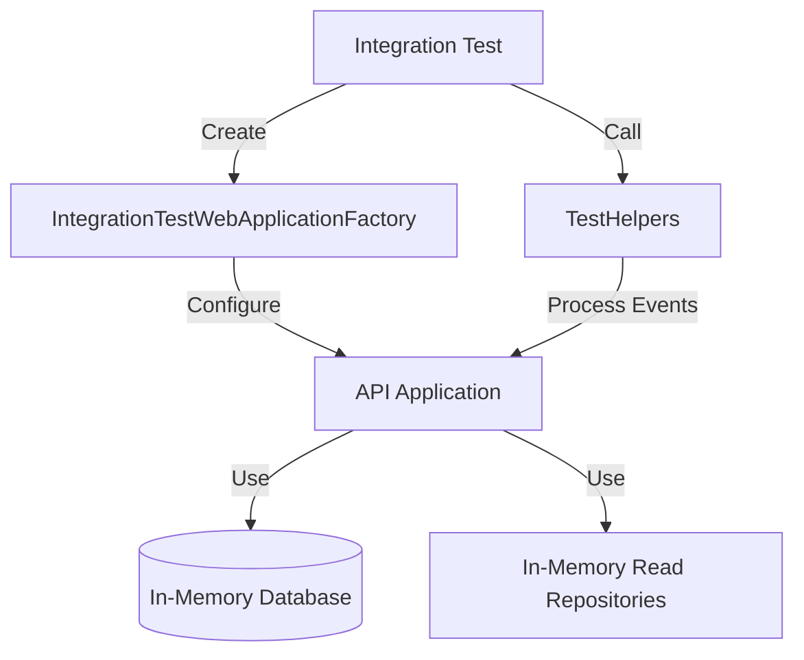

# Testing Guide

## Integration Testing

The project uses xUnit for integration testing with a custom `WebApplicationFactory` for test isolation.

### Test Architecture



### Key Components

#### IntegrationTestWebApplicationFactory

Custom factory that configures the test environment:

- **In-Memory Database**: Each factory instance uses a unique in-memory database name (`Guid.NewGuid().ToString()`) to ensure test isolation between different test classes.
- **Service Overrides**: Replaces production SQL Server contexts with `InMemoryDatabase` providers.
- **Read Model Isolation**: Both write and read DbContexts are replaced with in-memory versions, maintaining the CQRS separation even in tests.

#### TestHelpers

Utility class for common test operations:

**`ProcessPendingEventsAsync(IServiceProvider services)`**
- Manually triggers background event processing in tests
- Waits for both `Pending` and `Processing` events to complete
- Throws exception if any events fail after retries
- Essential for tests that verify read model updates

### Test Patterns

#### Basic Test Structure

```csharp
public class MyControllerTests : IClassFixture<IntegrationTestWebApplicationFactory>
{
    private readonly IntegrationTestWebApplicationFactory _factory;

    public MyControllerTests(IntegrationTestWebApplicationFactory factory)
    {
        _factory = factory;
    }

    [Fact]
    public async Task MyTest()
    {
        // Arrange
        var client = _factory.CreateClient();
        
        // Act
        var response = await client.PostAsJsonAsync("/api/v1/posts", dto);
        
        // Process background events
        await TestHelpers.ProcessPendingEventsAsync(_factory.Services);
        
        // Assert
        var result = await client.GetAsync("/api/v1/posts");
        // ... assertions
    }
}
```

#### Testing with Background Events

When testing features that publish domain events:

1. **Perform Action**: Execute the command that triggers the event
2. **Process Events**: Call `TestHelpers.ProcessPendingEventsAsync(_factory.Services)`
3. **Verify Results**: Assert on read model updates or side effects

Example:

```csharp
[Fact]
public async Task CreatePost_ShouldUpdateReadModel()
{
    var client = _factory.CreateClient();
    
    // Create post (publishes PostCreatedEvent)
    var response = await client.PostAsJsonAsync("/api/v1/posts", createDto);
    var postId = await response.Content.ReadFromJsonAsync<Guid>();
    
    // Process the PostCreatedEvent
    await TestHelpers.ProcessPendingEventsAsync(_factory.Services);
    
    // Verify read model was updated
    var getResponse = await client.GetAsync("/api/v1/posts");
    var posts = await getResponse.Content.ReadFromJsonAsync<PagedResult<PostDto>>();
    Assert.Contains(posts.Items, p => p.Id == postId);
}
```

### Test Isolation

Each test class gets its own:
- Unique in-memory database instance
- Separate `WebApplication` instance
- Isolated in-memory read repositories (via singleton per factory)

This ensures tests can run in parallel without interference.

### Thread Safety Considerations

In-memory repositories use `ConcurrentDictionary<Guid, T>` to handle concurrent access from:
- API requests (via HTTP client)
- Background event processors
- Test helper event processing

### Common Pitfalls

❌ **Don't**: Forget to call `ProcessPendingEventsAsync` when testing event-driven features
```csharp
var response = await client.PostAsJsonAsync("/api/v1/posts", dto);
// Missing: await TestHelpers.ProcessPendingEventsAsync(_factory.Services);
var result = await client.GetAsync("/api/v1/posts"); // Read model not updated yet!
```

✅ **Do**: Always process events before asserting on read models
```csharp
var response = await client.PostAsJsonAsync("/api/v1/posts", dto);
await TestHelpers.ProcessPendingEventsAsync(_factory.Services);
var result = await client.GetAsync("/api/v1/posts"); // Read model is updated
```

❌ **Don't**: Share factory instances across test classes
```csharp
// This causes database contamination
public class SharedFactoryTests : IClassFixture<IntegrationTestWebApplicationFactory>
```

✅ **Do**: Use separate factory instances per test class
```csharp
// Each test class gets its own isolated factory
public class PostTests : IClassFixture<IntegrationTestWebApplicationFactory>
public class CommentTests : IClassFixture<IntegrationTestWebApplicationFactory>
```

### Running Tests

```bash
# Run all tests
dotnet test

# Run specific test class
dotnet test --filter "FullyQualifiedName~PostsControllerTests"

# Run with detailed output
dotnet test --logger "console;verbosity=detailed"
```
